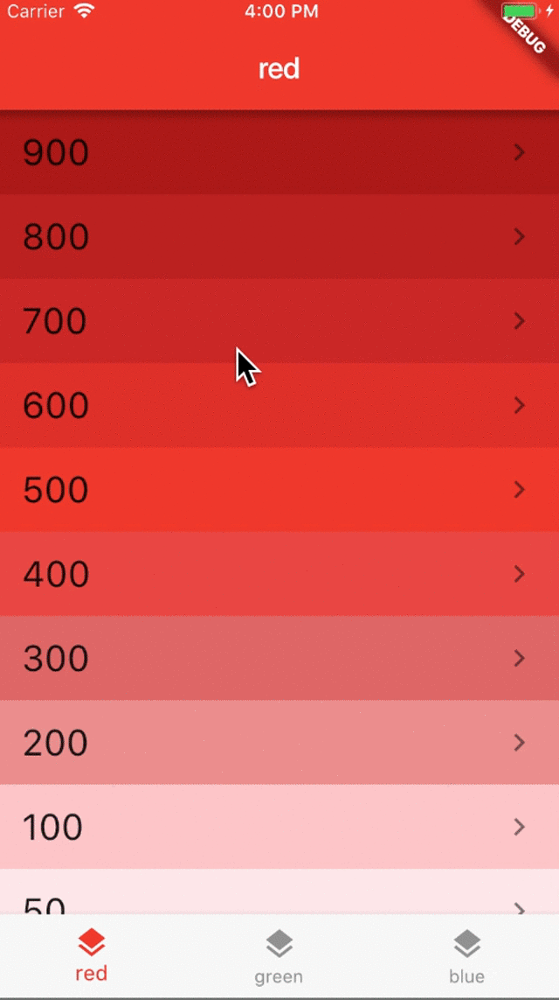

## Preview

In this example each tab has its own navigation stack. This is so that we don’t lose the navigation history when switching tabs.

This is a very common use case for a lot of apps.

**How is it built?**

- Create an app with a `Scaffold` and a `BottomNavigationBar`.
- In the `Scaffold` body, create a `Stack` with one child for each tab.
- Each child is an `Offstage` widget with a child `Navigator`.
- Don't forget to handle Android back navigation with `WillPopScope`.

The article which I referred to:

- [Flutter Bottom Navigation Bar with Multiple Navigators: A Case Study](https://codewithandrea.com/articles/2018-07-07-multiple-navigators-bottom-navigation-bar/)

